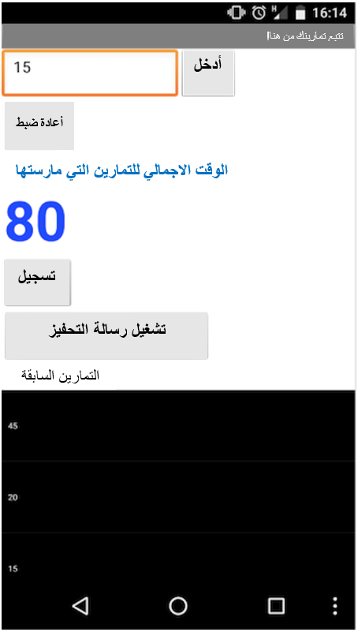

## المقدمة

ستوضح لك هذه البطاقات كيفية استخدام App Inventor لإنشاء تطبيق يتتبع مقدار التمرينات التي قمت بها.

### ما الذي ستصنعه

 * سوف ينتهي بك الأمر بشيء يشبه هذا:

--- انهيار ---
---
العنوان: ما الذي سوف تتعلمه
---

+ يأخذ مُدْخَل نصي من المستخدم ويعرضه
+ تخزين المعلومات في القائمة
+ استخدام حلقة تكرارية لقراءة عناصر القائمة
+ حفظ المعلومات في الملف على الهاتف
+ تحميل وعرض المعلومات من الملف
+ إتخاذ الإجراءات الخاصة بك
+ استخدام مسجل الصوت في الهاتف وقم بتشغيل الصوت الذي سجلته

--- /collapse ---

--- collapse ---
---
العنوان: ما الذي سوف تحتاج إليه
---

### الأجهزة

+ كمبيوتر قادر على الوصول إلى App Inventor
+ إتصال بالإنترنت

**إختياري:**

+ هاتف اندرويد أو جهاز لوحي

--- /collapse ---