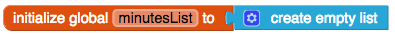

## تسجيل التمرين

+ قم بإنشاء مشروع جديد وقم بتسميته ، على سبيل المثال `GetFit`.

+ انقر على Screen1 أسفل المكونات وقم بتغيير خاصية العنوان إلى `تتبع التمرين هنا!`.

+ ابحث عن مكون TextBox في لوحة الألوان (ضمن **واجهة المستخدم**) وأضفها إلى تطبيقك ، إلى جانب الزر.

+ تغيير خاصية **نص** للزر إلى `أدخل`.

+ لترتيب المكونات جنبًا إلى جنب ، اسحب **HorizontalArrangement** على الشاشة (ستجدها في **Layout**) واسحب TextBox و Button إليها.

+ ابحث عن خاصية **التلميح** لـ TextBox واكتب `دقائق`. سيظهر هذا بشكل خافت في مربع النص إذا لم يكتب المستخدم أي شيء حتى الآن ، لذا فهم يعرفون ما يجب كتابته.

+ ضع علامة في المربع الذي يقول "NumbersOnly" بحيث يمكن إدخال رقم فقط في TextBox.

عظيم! يمكن للمستخدم كتابة عدد الدقائق التي يتمرن فيها. الآن تريد حفظ هذه المعلومات عندما تضغط على الزر.

+ التبديل إلى كتل و اخراج كتلة `عند Button.Click`.

+ أول شيء سوف تحتاجه هو إنشاء متغير **محلي** لتخزين قيمة TextBox. الحصول على `تهيئة الاسم المحلي للكتلة` من المتغيرات ، وقم بإدخاله في المربع `عند نقر زر`.

+ ثم انقر حيث يظهر `الاسم` وبدلاً من ذلك اكتب `دقيقة` لتسمية المتغير المحلي الخاص بك.

+ إخراج كتلة `Textbox.Text` وإرفاقه على كتلة `initialise local mins` لتخزين ما تم كتابتها في مربع نص.

الآن بعد أن قمت بأسترجاع هذه المعلومات، سوف تنشئ **قائمة** لوضعها فيها. بعد كل شيء ، تريد أن تكون قادرا على تسجيل الكثير من جلسات التمرين!

+ في الجزء العلوي من التعليمات البرمجية الخاصة بك ، أضف `initialize global name to` ، وتسميته `minutesList`. ثم اعثر على كتلة `create empty list` من قوائم واستخدامها لتهيئة قائمتك.

+ من قوائم ، خذ الكتلة `add items to list` ووضعها في كتلة المتغير المحلي الخاص بك.

تحتاج إلى إرفاق شيئين لهذه الكتلة: القائمة التي تريد أن تضيف شيئا لها، و "شيء" التي تريد إضافتها، وهذا يعني **العنصر**.

+ مرر مؤشر الماوس فوق اسم متغير قائمتك العامة واحصل على `get global minutesList` الكتلة التي تظهر. قم بتوصيل هذا بالمرفق `list` من كتلة `add items to list`.

+ ثم افعل الشيء نفسه مع المتغير المحلي ، `mins`، لإرفاق كتلة `get mins` على جزء **item** من `add items to list`.

في البطاقة التالية ، ستضيف جميع عناصر القائمة معًا لحساب إجمالي مقدار التمرين الذي قمت به!
