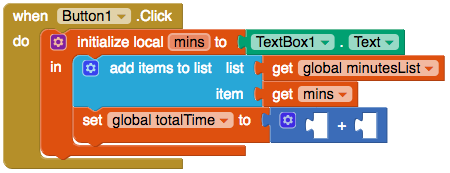
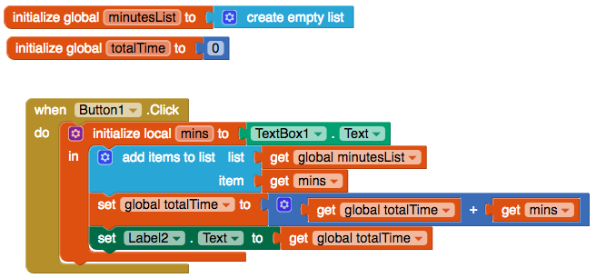

## حساب المجموع

+ قم بأنشاء متغير عمومي آخر يسمى `totalTime`.

+ إرفاق كتلة `0` من الرياضيات لتهيئة المتغير إلى `0`.

في كل مرة تقوم فيها بحفظ وقت جديد ، ستقوم بإضافته إلى قيمة `totalTime`.

+ حرك مؤشر الماوس فوق المتغير `totalTime` وانتزع كتلة `set global totalTime to`. أرفقه أسفل كتلة `add items to list `.

+ من Math ، خذ كتلة `+` وأرفقها بـ `set global totalTime to`.

+ على الجانب الأيسر من `+` قم بتوصيل كتلة `get global totalTime`. على الجانب الأيمن ، قم بتوصيل `get mins`.

--- collapse ---
---
العنوان: لا يمكنني العثور على الكتل!
---

يمكنك العثور على كتل `get` and `set` للمتغير عن طريق تمرير الماوس فوق اسم المتغير في كتلة orange `initialise`.

يمكنك أيضًا استخدام كتل `get` and `set` الموجودة في المتغيرات ، ثم انقر فوق السهم الصغير في كل كتلة لاختيار المتغير الخاص بك.

--- /collapse ---

الآن ، اعرض الوقت الإجمالي حتى يتمكن المستخدم من رؤيته!

+ ارجع إلى طريقة العرض "مصمم" وأضف تسميتين أخريين إلى تطبيقك. قم بضبط خاصية Text لأول واحد إلى `إجمالي الدقائق التي تمرنتها:`

+ قم بتغيير خاصية Text الخاصة بالتسمية الثانية بحيث تكون فارغة ، وقم بتدوين اسم هذا التصنيف (على سبيل المثال ، Label2) بحيث يمكنك ضبطه على الوقت الإجمالي في التعليمات البرمجية الخاصة بك!

+ إذا كنت ترغب في ذلك ، فقم بتغيير حجم ولون التسميات. لقد جعلت لوني أزرق واخترت **FontBold** لجعلها غامقة ، وغيرت **FontSize** من الملصق الثاني إلى `50`!

+ قم بالتبديل مرة أخرى إلى كتل وإضافة كتلة `set Label.Text to` إلى التعليمات البرمجية الخاصة بك ، جنبا إلى جنب مع كتلة `get global totalTime` (اختر اسم الملصق الذي قمت بتدوينه أعلاه!).

و هذا ما يجب أن تبدو عليه التعليمات البرمجية الخاصة بك:

