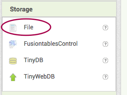

## حفظ المعلومات

في الوقت الحالي ، يحفظ تطبيقك المعلومات فقط طالما أن التطبيق قيد التشغيل. سيكون من المفيد أن تتذكر أوقات التمرين حتى بعد إغلاق التطبيق وإعادة تشغيله ، أليس كذلك؟ للقيام بذلك ، ستقوم بتخزين المعلومات في ملف على الهاتف أو الجهاز اللوحي ، وسوف تقرأ من هذا الملف في كل مرة يتم فيها تشغيل التطبيق.

+ في طريقة العرض "مصمم" ، قم بإضافة مكون **File** إلى التطبيق الخاص بك. ستجده في **Storage**. هذا مكون غير مرئي ، لذلك لن تشاهده على الشاشة.

+ انتقل الآن إلى كتل وانقر فوق File1 للحصول على كتلة `call File1.AppendToFile`. إضافة هذا إلى التعليمات البرمجية الخاصة بك بعد كتلة `set Label.Text to`.

--- collapse ---
---
العنوان: ماذا تعمل الكتلة الجديدة؟
---

هذه الكتلة تأخذ اثنين من المعاملات ****. المعامل هو جزء من المعلومات التي تعطيها للكتلة. عادة ، ستفعل الكتلة شيئًا بهذه المعلومات.

المعامل الأول ، `text`، هو النص الذي تريد تخزينه في ملف. الثاني ، `fileName` هو اسم الملف الذي تريد استخدامه للتخزين.

الرمز سوف يأخذ النص الذي تقدمه وإضافته إلى نهاية النص في الملف. الشيء المهم حقًا هو أنه إذا لم يكن الملف موجودًا بعد ، فسوف تقوم الكتلة بإنشائه لك أولاً.

--- /collapse ---

+ للمعامل `fileName` ، قم بإرفاق كتلة `""` من النص ، واكتب `ExerciseTracker.txt`.

+ لمعامل `text`، إرفاق كتلة `join` ، و كتلة `get mins` ، وكتلة نص آخرى فارغة `""`. اكتب `\n` في كتلة نص فارغة (تأكد من استخدام شرطة مائلة للخلف `` \ `و ** ليس ** شرطة مائلة للأمام `` / `).

--- collapse ---
---
العنوان: ماذا كتبت للتو؟
---

الرمز `\n` هو مجموعة خاصة من الأحرف المستخدمة عندما تريد الانتقال إلى سطر جديد في النص.

تأخذ التعليمة البرمجية الخاص بك عدد الدقائق التي كتبها المستخدم ، وإضافة سطر جديد في النهاية قبل حفظه في الملف.

هذا يعني أنه في كل مرة يدخل فيها المستخدم عددًا من الدقائق ، سيتم حفظه في سطر منفصل في الملف النصي الذي حددته `ExerciseTracker.txt`.

--- /collapse ---

الآن قمت بحفظ البيانات في الملف ، فأنت بحاجة إلى قراءة هذه البيانات عند تحميل التطبيق!

+ خذ كتلة `when Screen1.initialise` وإضافة في `call File1.readFrom` ، إرفاق كتلة نصية باسم الملف ` ExerciseTracker.txt ` كتبته كما كان من قبل.

هذه الاستدعاء هو **asynchronous**، مما يعني أنها ستذهب وتقرأ الملف ثم تخبرك عند الانتهاء.

+ من File1 ، أخرج كتلة `when File1.GotText`</0>.

يحتوي المتغير `text` على كل النص من الملف. ستستخدم هذا لملء المتغير **list** الذي قمت بإنشائه لجمع الدقائق. لكن أولاً ، تحتاج إلى تقسيمه لفصل كل سطر.

+ أضف الكتل التالية داخل `GotText`:

--- collapse ---
---
العنوان: كيف يعمل التقسيم؟
---

تأخذ الكتلة `split` قطعة واحدة من النص وتقسيمها إلى عدة أجزاء منفصلة.

تخيل أن لديك نصًا كبيرًا طويلًا ، ويتكون من مجموعة من القطع التي تم ربطها معًا بين النقاط. يتيح لك استخدام كتلة `split` تقسيم هذا النص إلى أجزاء منفصلة من النص وإزالة النقاط.

ما تضعه في `at` يقرر كيفية تقسيم النص.

يبحث في النص عن القيمة الموجودة في المربع " `at` ، وفي كل مرة يعثر عليها ، فإنه "يقطع" جزءًا آخر من النص. تتم إزالة النص الذي يطابق قيمة `at` في العملية.

ما تحصل عليه هو قائمة تحتوي على مجموعة من النصوص المنفصلة!

--- /collapse ---

الآن سوف تلخص كل الدقائق التي قمت بتحميلها للتو من الملف وعرض الوقت الإجمالي.

+ ضمن `set global minutesList`، أضف الرمز البرمجي لضبط المتغير العام `totalTime` إلى `0`:

+ في كتل التحكم ، ابحث عن الكتلة `for each item in list`، وقم بإرفاق `get global minutesList`.

+ داخل هذا ، أضف كتلة `set total totalTime` ، ثم كتلة `+` مع كتلة `get total totalTime` على اليسار. تذكر أنك فعلت هذا من قبل لإضافة شيء إلى الوقت الإجمالي. الفرق الوحيد هذه المرة هو أن المتغير الذي وضعته على يمين `+`: item `الحالي` من القائمة.

+ أخيرًا ، أضف `set Label.Text to` و كتلة `get global totalTime` كما كان من قبل.

+ إليك ما يجب أن تبدو عليه الكتلة البرمجية `GotText` الآن. اختبر تطبيقك للتأكد من أن كل شيء يعمل!

