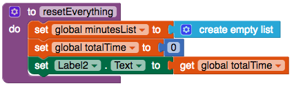

## إعادة الوضع السابق

إذا كنت مثلي ، فقد ترغب في حذف جميع البيانات التي تم إدخالها مسبقًا وبدء التتبع مرة أخرى عند الصفر. دعنا نضيف زرًا لنتيح لك القيام بذلك!

+ في طريقة العرض "مصمم" ، أضف زر. تغيير التسمية إلى `إعادة تعيين`.

+ انتقل إلى "الكتل" وقم بإضافة `when Button Click` " للزر الجديد.

+ في هذه الكتلة ، أضف `call File1.Delete` مع كتلة نص تعطي اسم الملف `ExerciseTracker.txt`.

الآن ستقوم بإنشاء كتلة جديدة تمامًا خاصة بك!

+ انقر على **Procedures** في الكتل المدمجة واسحب للخارج `to procedure do`.

+ انقر فوق علامة `procedure` وقم بتغييره إلى `resetEverything`.

--- collapse ---
---
title: ما هو الإجراء؟
---

والإجراء هو مجموعة من التعليمات البرمجية التي يمكنك **إعادة استخدام** بسهولة.

بدلاً من تكرار الكتل نفسها في عدة أماكن ، يمكنك وضعها جميعًا في كتلة واحدة تسمى الإجراء. ثم يمكنك استخدام كتلة واحدة فقط عندما تريد تشغيل هذه الكتل!

يمكنك إعطاء الإجراء أي اسم تريده.

--- /collapse ---

+ داخل الكتلة `resetEverything` ، أضف كتلًا لضبط `minutesList` إلى قائمة فارغة جديدة ، واضبط الوقت إجمالي `totalTime` إلى `0`، وقم بعرض الوقت الإجمالي الجديد:

+ أخيرًا ، في `عندما يكون زر Click Click` من الزر الذي قمت بإنشائه الآن ، أضف resetEverything بلوك `من الإجراءات`.

الآن يجب أن تكون قادرًا على مسح جميع التمرينات المسجلة بالنقر فوق الزر الجديد!

