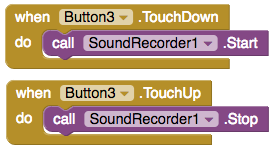
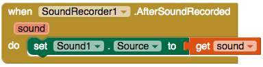

## تسجيل رسالة!

الحصول على اللياقة البدنية ليس بالأمر السهل: قد يكون من الصعب في بعض الأحيان تحفيز نفسك على ممارسة الرياضة. ماذا عن السماح للمستخدم بتسجل رسالة يمكنه تشغيلها عندما يحتاج إلى التحفيز؟

+ انتقل إلى طريقة العرض "مصمم" وأضف زرين آخرين إلى التطبيق الخاص بك. قم بضبط تسمياتهم على `تشغيل الرسالة التحفيزية` و `تسجيل`، أو شيء مشابه.

+ ثم ، من **Media**، أضف مكون **Sound** و **SoundRecorder**. تمامًا مثل مكون الملف ، لن تكون هذه مرئية على الشاشة.

+ في الكتل ، أضف كتلة `when Button.TouchDown` و كتلة `when Button.TouchUp` للزر أضف `Record`. هذه المرة ، لن تضبط النقرة المعتادة على الزر. بدلاً من ذلك ، ستبدأ التسجيل عندما يضغط المستخدم مع الاستمرار على الزر ، وستتوقف عن التسجيل عندما يتوقف الضغط.

+ أضف `call SoundRecorder.Start` إلى كتلة `TouchDown` ، و `call SoundRecorder.Stop` إلى كتلة `TouchUp` ، مثل هذا:

الآن يمكنك تسجيل الصوت ، تحتاج إلى إعداد مكون الصوت لتشغيله!

+ أسحب كتلة `when SoundRecorder.AfterSoundRecorded`.

+ في مكون الصوت ، ابحث عن كتلة `set Sound1.Source to` ووضعها داخل الكتلة التي أخرجتها للتو.

الكتلة `AfterSoundRecorded` تحتوي على متغير يسمى `sound`. هذا هو المكان الذي تخبر فيه الكتلة بالبحث عن ملف الصوت الذي قمت بتسجيله.

+ مرّر مؤشر الماوس فوق المتغير `sound` وأخذ كتلة `get sound` لأرفاقها كمصدر لمكون الصوت:

+ أخيرًا ، أخرج كتلة `Button.Click` للزر `Play`. في ذلك ، `call Sound1.Play` من مكون الصوت.

+ اختبر التطبيق واستمتع بتسجيل بعض رسائل التحفيز الخاصة بك وأعد تشغيلها!

--- challenge ---

## التحدي: حفظ الصوت

- تحقق مما إذا كان يمكنك استخدام مكون ملف لجعل التطبيق يتذكر موقع ملف الصوت الذي سيتم تشغيله.

--- hints ---

--- hint ---

+ استخدم مكون ملف آخر وملف منفصل يسمى شيئًا آخر ، على سبيل المثال `MotivationalMessage.txt`.

+ استخدم كتلة `SaveFile` بدلاً من `AppendToFile`، بحيث يمكنك دائمًا التسجيل فوق الملف السابق بالتسجيل الجديد.

--- hint/ ---

--- hints/ ---

--- /تحدي ---
