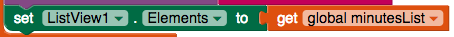

## عرض تاريخ التمرين

في الوقت الحالي ، يعرض تطبيقك الوقت الإجمالي للدقائق التي تمارسها فقط ، ولكن بما أنك حصلت على قائمة بجميع الجلسات الفردية ، فلماذا لا تظهر ذلك أيضًا؟

+ انتقل إلى طريقة العرض "مصمم" وقم بإضافة **ListView** من **User Interface**.

+ إذا أردت ، يمكنك أيضًا إضافة تسمية أعلى القائمة يوضح شيئًا مثل `تاريخ التمرين:`.

كما كنت قد خمنت ، يعرض ListView قائمة من الأشياء. على غرار كيفية ضبط خاصية Text لـ Label إلى نص معين ، تقوم بضبط الخاصية **Elements** الخاصة بـ ListView إلى القائمة. سوف تفعل هذا في مكانين في التعليمات البرمجية الخاصة بك.

أولاً ، تحتاج إلى تحديث ListView كلما أدخل المستخدم وقت تمرين جديد.

+ في `Button.Click` للزر `Enter` ، أضف كتلة `set ListView.Elements to` و كتلة `get global minutesList` أدناه `AppendToFile`.

ثانياً ، تحتاج إلى تحديث ListView كلما قمت بتحميل ملف القائمة.

+ ابحث عن التعليمة البرمجية `File1.GotFile` وأضف `set ListView.Elements to` و `get global minutesList` (نفس التعليمة البرمجية أعلاه) أسفل يمين قائمة ا كتلة `set global minutesList to`.

وقد اكتمل تطبيقك!

--- challenge ---

## التحدي: تتبع نوع التمرين

+ ماذا عن إضافة TextBox آخر يتيح للمستخدم أيضًا تسجيل نوع التمرين الذي قام به؟ يجب عليك التفكير في الكود الإضافي الذي ستحتاجه ، مثل القوائم والحلقات ، وكيفية تخزين المعلومات الجديدة في ملف.

+ يمكنك إما استخدام نفس الملف (مع بعض التعليمات البرمجية الإضافية `join` و `split`) ، أو تعليمة برمجية منفصلة.

--- /challenge ---

يمكنك رؤية مثال لهذا التطبيق على App Inventor على [dojo.soy/intermedapp](http://dojo.soy/intermedapp){:target="_blank"}.

***
تمت ترجمة هذا المشروع بواسطة متطوعين:

رائد موسى الجعفري

زهراء عبدالرزاق مصيخ

بفضل المتطوعين ، يمكننا إعطاء الناس في جميع أنحاء العالم فرصة للتعلم بلغتهم الخاصة. يمكنك مساعدتنا في الوصول إلى المزيد من الأشخاص من خلال التطوع للترجمة - مزيد من المعلومات على [rpf.io/translate](https://rpf.io/translate).
