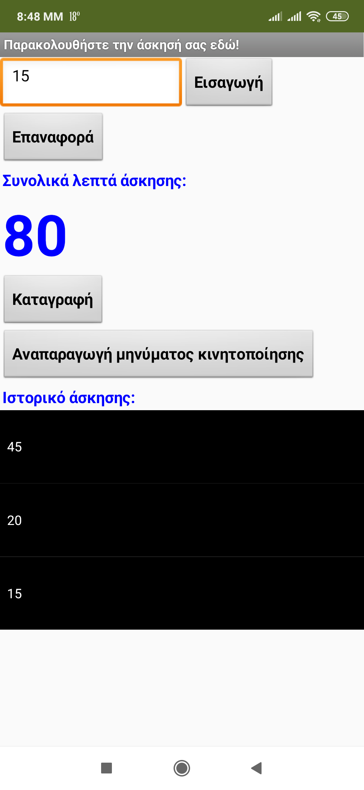

## Εισαγωγή

Αυτές οι κάρτες θα σου δείξουν πώς να χρησιμοποιήσεις το App Inventor για να δημιουργήσεις μια εφαρμογή που παρακολουθεί την άσκηση που έχεις κάνει.

### Τι θα φτιάξεις

 * Θα καταλήξεις με κάτι που μοιάζει με αυτό:

--- collapse ---
---
title: Τι θα μάθεις
---

+ Λήψη εισαγωγής κειμένου από το χρήστη και εμφάνισή του
+ Αποθήκευση πληροφοριών σε μια λίστα
+ Χρήση βρόχου για διάβασμα των στοιχείων μιας λίστας
+ Αποθήκευση πληροφοριών σε ένα αρχείο στο τηλέφωνο
+ Φόρτωση και προβολή πληροφοριών από ένα αρχείο
+ Δημιουργώντας τις δικές σου διαδικασίες
+ Χρησιμοποίησε τη συσκευή εγγραφής ήχου του τηλεφώνου και κάνε αναπαραγωγή ενός ήχου που έχεις καταγράψει

--- /collapse ---

--- collapse ---
---
title: Τι θα χρειαστείς
---

### Υλικό (Hardware)

+ Ένας υπολογιστής που έχει πρόσβαση στο App Inventor
+ Σύνδεση στο διαδίκτυο

**Προαιρετικά:**

+ Ένα τηλέφωνο ή tablet Android

--- /collapse ---