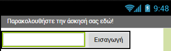
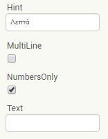
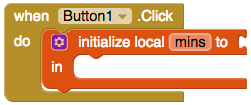
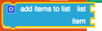
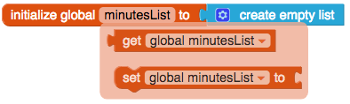
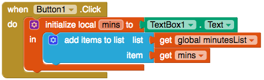

## Καταγραφή άσκησης

+ Δημιούργησε ένα νέο έργο και δώσε του ένα όνομα, για παράδειγμα `GetFit`.

+ Κάνε κλικ στην Screen1 κάτω από την περιοχή Components και άλλαξε τον τίτλο σε `Παρακολουθήστε την άσκησή σας εδώ!`.

+ Βρες το αντικείμενο TextBox στην περιοχή Palette (κάτω από την ομάδα **User Interface**) και προσθέσέ το στην εφαρμογή, μαζί με ένα αντικείμενο Button.

+ Άλλαξε την ιδιότητα **Text** του Button σε `Εισαγωγή`.

+ Για να τακτοποιήσεις τα αντικείμενα το ένα δίπλα στ' άλλο, σύρε το αντικείμενο **HorizontalArrangement** στην οθόνη (θα το βρείς στην ομάδα **Layout**) και σύρε το TextBox και το Button σε αυτό.

+ Βρες την ιδιότητα **Hint** για το TextBox και πληκτρολόγησε `Λεπτά`. Αυτό θα εμφανιστεί αχνά στο πλαίσιο κειμένου, αν ο χρήστης δεν έχει πληκτρολογήσει τίποτα ακόμα, έτσι ώστε να ξέρει τι να πληκτρολογήσει.

+ Επίλεξε το κουτάκι κάτω από το "NumbersOnly", έτσι ώστε μόνο ένας αριθμός να μπορεί να εισαχθεί στο TextBox.

Εξαιρετικά! Ο χρήστης μπορεί να πληκτρολογήσει τον αριθμό των λεπτών που ασκήθηκε. Τώρα θέλεις να αποθηκεύεται αυτή η πληροφορία όταν πατηθεί το κουμπί.

+ Πήγαινε στην ενότητα Blocks και βγάλε ένα `when Button.Click`.

+ Το πρώτο πράγμα που θα χρειαστεί, είναι να δημιουργήσεις μία **τοπική** μεταβλητή για να αποθηκεύσεις σ' αυτήν την τιμή που υπάρχει στο TextBox. Πιάσε το `initialise local name to` μπλοκ από τις μεταβλητές και κούμπωσέ το το στο `when Button Click`.

+ Στη συνέχεια κάνε κλικ εκεί που λέει `name` και πληκτρολόγησε `mins` για να ονομάσεις την τοπική μεταβλητή.

+ Βγάλε ένα μπλοκ `Textbox.Text` και σύνδεσέ το στο μπλοκ `initialize local mins to` για να αποθηκεύσεις ό,τι πληκτρολογήθηκε στο TextBox.

Τώρα που έχεις ανακτήσει αυτές τις πληροφορίες, θα δημιουργήσεις μία **λίστα** για να τις βάλεις μέσα. Εξ' άλλου, θες να καταγράφεις πολλές περιόδους άσκησης!

+ Στην κορυφή του κώδικα, πρόσθεσε ένα `initialize global name to` μπλοκ, και ονόμασέ το `minutesList`. Στη συνέχεια, βρες το `create empty list` μπλοκ από το Lists και χρησιμοποίησέ το για να αρχικοποιήσεις τη λίστα σου.

+ Από το Lists, πάρε το μπλοκ `add items to list` και τοποθέτησέ το στο μπλοκ τοπικών μεταβλητών.

Θα πρέπει να συνδέσεις δύο πράγματα σε αυτό το μπλοκ: τη λίστα μέσα στην οποία θα προσθέσεις κάτι και αυτό το «κάτι» που θέλεις να προσθέσεις, δηλαδή το **item**.

+ Πέρασε το δείκτη του ποντικιού πάνω από το όνομα της μεταβλητής της καθολικής λίστας και τράβηξε το μπλοκ `get global minutesList` που εμφανίζεται. Σύνδεσέ το στην εγκοπή `list` του μπλοκ `add items to list`.

+ Κάνε το ίδιο με την τοπική μεταβλητή, `mins`, για να συνδέσεις ένα μπλοκ `get mins` στην **item** εγκοπή του μπλοκ `add items to list`.

Στην επόμενη κάρτα, θα προσθέσεις όλα τα στοιχεία της λίστας μαζί για να υπολογίσεις το συνολικό ποσό άσκησης που έχεις κάνει!
