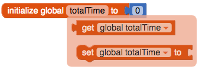

## Υπολογισμός του συνόλου

+ Δημιούργησε μια άλλη καθολική μεταβλητή με το όνομα `totalTime`.

+ Σύνδεσε το μπλοκ `0` από το Math για να αρχικοποιήσεις την μεταβλητή σε `0`.

Κάθε φορά που αποθηκεύεις μια νέα ώρα, θα την προσθέτεις στην τιμή της `totalTime`.

+ Πέρασε το δείκτη του ποντικιού πάνω από τη μεταβλητή `totalTime` και τράβηξε το μπλοκ `set global totalTime to`. Σύνδεσέ το κάτω από το `add items to list` μπλοκ.

+ Από το Math, πάρε το μπλοκ `+` και σύνδεσέ το στο `set global totalTime to`.

+ Στην αριστερή πλευρά του `+`, σύνδεσε το `get global totalTime` block. Στη δεξιά πλευρά, σύνδεσε το `get mins`.

--- collapse ---
---
title: I can't find the blocks!
---

Μπορείς να βρεις τα `get` και `set` μπλοκ για μια μεταβλητή, περνώντας το ποντίκι πάνω από το όνομα της μεταβλητής στο πορτοκαλί `initialise` μπλοκ.

Μπορείς επίσης να χρησιμοποιήσεις τα `get` και `set` μπλοκ που βρίσκονται στην επιλογή Variables και στη συνέχεια να κάνεις κλικ στο μικρό βέλος σε κάθε μπλοκ για να επιλέξεις τη μεταβλητή σου.

--- /collapse ---

Τώρα, εμφάνισε το σύνολο έτσι ώστε να μπορεί να το δει ο χρήστης!

+ Επίστρεψε στην προβολή Designer και πρόσθεσε δύο επιπλέον label στην εφαρμογή σoυ. Όρισε την ιδιότητα Text του πρώτου σε `Συνολικά λεπτά άσκησης:`

+ Άλλαξε την ιδιότητα Text του δεύτερου label έτσι ώστε να είναι κενή και σημείωσε το όνομά του (για παράδειγμα Label2) ώστε να μπορείς να την ορίσεις μέσα στο συνολικό χρόνο στον κώδικά σου!

+ Αν θέλεις άλλαξε το μέγεθος και το χρώμα των labels. Εγώ για παράδειγμα άλλαξα το χρώμα σε μπλε και τσέκαρα την επιλογή **FontBold** για να κάνω έντονη γραφή, και άλλαξα το **FontSize** του δεύτερου label σε `50`!

+ Πήγαινε ξανά στην προβολή Blocks και πρόσθεσε το μπλοκ `set Label.Text to` στον κώδικά σου, μαζί με το `get global totalTime` μπλοκ (επίλεξε το όνομα του label που είχες σημειώσει παραπάνω!).

Έτσι πρέπει να φαίνεται ο νέος σου κώδικας:

