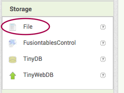
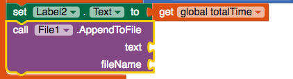
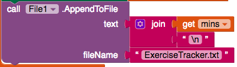
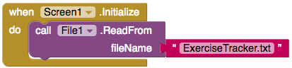
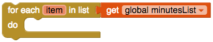
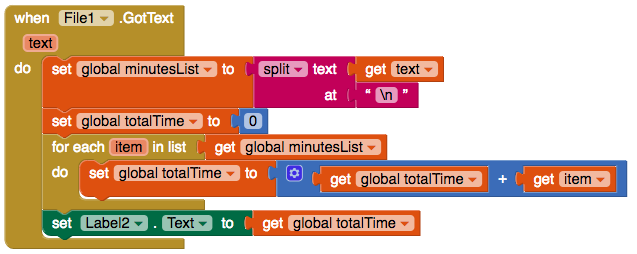

## Saving the information

Right now, your app only saves information so long as the app is running. It would be much more useful for it to remember your exercise times even after you close the app and restart it, right? To do this, you will store the information in a file on the phone or tablet, and read from this file every time the app starts.

+ In the Designer view, add a **File** component to your app. You'll find it in **Storage**. This is an invisible component, so you won't see it on the screen.

+ Now go to Blocks and click on File1 to get the block `call File1.AppendToFile`. Add this to your code after the `set Label.Text to` block.

--- collapse ---
---
title: What does the new block do?
---

This block takes two **parameters**. A parameter is a piece of information that you give a block. Usually, the block will do something with that information.

The first parameter, `text`, is the text that you want to store in a file. The second, `fileName` is the name of the file you want to use for storage.

The code will take the text you give it and add it to the end of the text in the file. The really handy thing is that if the file doesn't exist yet, the block will create it for you first.

--- /collapse ---

+ For the `fileName` parameter, attach a `""` block from Text, and type in `ExerciseTracker.txt`.

+ For the `text` parameter, attach a `join` block, a `get mins` block, and another blank `""` Text block. Type `\n` into the blank text block (make sure you use a backslash ``\` and **not** a forward slash``/`).

--- collapse ---
---
title: What did I just type?
---

The symbol `\n` is a special combination of characters used when you want to go onto a new line in a text.

Your code is taking the number of minutes that the user typed in, and adding a new line at the end before saving it to the file.

That means that each time the user enters a number of minutes, it will be saved on a separate line in the text file you've named `ExerciseTracker.txt`.

--- /collapse ---

Now you've saved data to the file, you need to read that data whenever the app loads!

+ Take a `when Screen1.initialise` block, and add in `call File1.readFrom`, attaching a Text block with the file name `ExerciseTracker.txt` typed in as before.

This call is **asynchronous**, meaning it will go and read the file and then tell you when it's done.

+ From File1, take out a `when File1.GotText` block.

The `text` variable contains all the text from the file. You will use this to fill the **list** variable you created to collect the minutes. But first, you need to split it up to separate each line.

+ Add the following blocks inside the `GotText`:

--- collapse ---
---
title: How does splitting work?
---

The `split` block takes one piece of text and splits it into several separate pieces.

Imagine you have one big long text, and it's made up of a bunch of pieces all joined together with dots in between. Using the `split` block would allow you to break this text up into the separate pieces of text and remove the dots.

What you put into the `at` decides how the text gets split.

It searches the text for the value in the `at` block, and each time it finds it, it 'chops off' another piece of the text. The text that matches the value of `at` is removed in the process.

What you get back is a list containing a bunch of separate pieces of text!

--- /collapse ---

Now you will sum up all the minutes you just loaded from the file and display the total.

+ Under the `set global minutesList`, add code to set the global variable `totalTime` to `0`:

+ In the Control blocks, find the block `for each item in list`, and attach a `get global minutesList` to it.

+ Inside this, add a `set global totalTime to` block, and then a `+` block with `get global totalTime` on the left. Remember, you did this before to add something to the total. The only difference this time around is that the variable you put on the right of the `+`: the current `item` of the list.

+ Finally, add `set Label.Text to` the and `get global totalTime` block as before.

+ Here's what your `GotText` block should look like now. Test out your app to make sure it all works!

