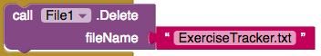
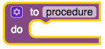
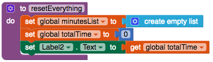
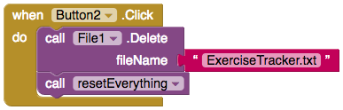

## Επαναφορά

If you're anything like me, you might want a way of deleting all the previously entered data and starting the tracking again at zero. Ας προσθέσεις ένα κουμπί για να το κάνεις αυτό!

+ Στην προβολή Designer, πρόσθεσε ένα Button. Άλλαξε την ετικέτα του σε `Επαναφορά`.

+ Go to Blocks and add a `when Button Click` block for the new button.

+ Σε αυτό το μπλοκ, πρόσθεσε `call File1.Delete` με ένα μπλοκ Text δίνοντας το όνομα του αρχείου `ExerciseTracker.txt`.

Τώρα θα δημιουργήσεις ένα ολοκαίνουργιο δικό σου μπλοκ εντολών!

+ Κάνε κλικ στο **Procedures** στα ενσωματωμένα μπλοκ και σύρε έξω ένα `to procedure do`.

+ Κάνε κλικ στην ετικέτα `procedure` και άλλαξέ την σε `resetEverything`.

--- collapse ---
---
title: What is a procedure?
---

Η διαδικασία είναι ένα σύνολο κώδικα που μπορείς **επαναχρησιμοποιείς** εύκολα.

Αντί να αντιγράφεις τα ίδια μπλοκ σε διάφορα σημεία, τα βάζεις όλα σε ένα μπλοκ που ονομάζεται διαδικασία. Στη συνέχεια μπορείς να χρησιμοποιήσεις ακριβώς αυτό το ένα μπλοκ κάθε φορά που θέλεις να εκτελέσεις αυτά τα μπλοκ!

Μπορείς να δώσεις σε μια διαδικασία οποιοδήποτε όνομα θέλεις.

--- /collapse ---

+ Inside the `resetEverything` block, add blocks to set the global `minutesList` to a new empty list, set the global `totalTime` to `0`, and display the new total:

+ Τέλος, στο μπλοκ `Button Click` του κουμπιού που μόλις δημιούργησες, πρόσθεσε το block `call resetEverything` από τις Procedures.

Τώρα θα πρέπει να μπορείς να καθαρίσεις όλη την καταγεγραμμένη άσκηση κάνοντας κλικ στο νέο κουμπί!

