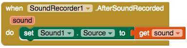
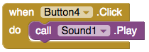

## Record a message!

Getting fit isn't easy: sometimes it can be hard to motivate yourself to go and exercise. How about letting the user record a message that they can play whenever they need some extra motivation?

+ Go to the Designer view and add two more Buttons to your app. Set their labels to `Play motivational message` and `Record`, or something similar.

+ Then, from **Media**, add a **Sound** and a **SoundRecorder** component. Just like the File component, these won't be visible on the screen.

+ In Blocks, add a `when Button.TouchDown` block and a `when Button.TouchUp` block for the `Record` button. This time, you're not going to detect the usual click of the button. Instead, you're going to start recording when the user presses and holds the button, and you'll stop recording when they stop pressing.

+ Add `call SoundRecorder.Start` to the `TouchDown` block, and `call SoundRecorder.Stop` to the `TouchUp` block, like this:

Now you can record sound, you need to set up the Sound component to play it!

+ Drag out the `when SoundRecorder.AfterSoundRecorded` block.

+ In the Sound component, find the `set Sound1.Source to` block and put that inside the block you just took out.

The `AfterSoundRecorded` block has a variable called `sound`. This is the where you tell the block where for find the sound file you've recorded.

+ Hover over the `sound` variable and take the `get sound` block to attach on as the source for the Sound component:

+ Finally, take out a `Button.Click` block for the `Play` button. In it, put a `call Sound1.Play` from the Sound component.

+ Test out the app and have some fun recording and playing back your own motivational messages!

--- challenge ---

## Challenge: save the sound

- See if you can use a File component to make the app remember the location of the sound file to play.

--- hints ---

--- hint ---

+ Use another File component and a separate file called something else, for example `MotivationalMessage.txt`.

+ Use a `SaveFile` block instead of `AppendToFile`, so that you always overwrite the previous file with the new recording.

--- /hint ---

--- /hints ---

--- /challenge ---
