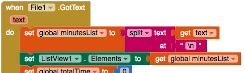

## Εμφάνιση του ιστορικού άσκησης

Προς το παρόν, η εφαρμογή σου εμφανίζει μόνο τα συνολικά λεπτά άσκησης, αλλά επειδή έχεις τον κατάλογο όλων των μεμονωμένων περιόδων σύνδεσης, γιατί να μην το δείξεις και αυτό;

+ Πήγαινε στην προβολή Designer και πρόσθεσε ένα **ListView** από το **User Interface**.

+ Εάν θέλεις, μπορείς επίσης να προσθέσεις μια ετικέτα πάνω από τη λίστα που να λέει κάτι σαν `Ιστορικό άσκησης:`.

Όπως ίσως έχεις μαντέψει, ένα ListView εμφανίζει μια λίστα με πράγματα. Similar to how you set the Text property of a Label to some text, you set the **Elements** property of a ListView to a list. Θα το κάνεις αυτό σε δύο μέρη στον κώδικά σου.

Πρώτον, πρέπει να ενημερώνεις το ListView κάθε φορά που ο χρήστης εισάγει νέο χρόνο άσκησης.

+ Στο μπλοκ `Button.Click` για το κουμπί `Εισαγωγή`, πρόσθεσε ένα `set ListView.Elements to` μπλοκ και ένα `get global minutesList` μπλοκ κάτω από το `AppendToFile`.

Δεύτερον, πρέπει να ενημερώσεις το ListView όποτε φορτώνεις το αρχείο λίστας.

+ Find your `File1.GotFile` code, and add `set ListView.Elements to` and `get global minutesList` (the same code as above) right below the `set global minutesList to` block.

Και η εφαρμογή σου ολοκληρώθηκε!

--- challenge ---

## Πρόκληση: Παρακολούθησε τον τύπο άσκησης

+ How about adding another TextBox that lets the user also record what kind of exercise they did? You'll have to think about what extra code you'll need, such as lists and loops, and how to store the new information in a file.

+ You can either use the same file (with some extra `join` and `split` code), or a separate one.

--- /challenge ---

You can see an example of this app on App Inventor at [dojo.soy/intermedapp](http://dojo.soy/intermedapp){:target="_blank"}.
