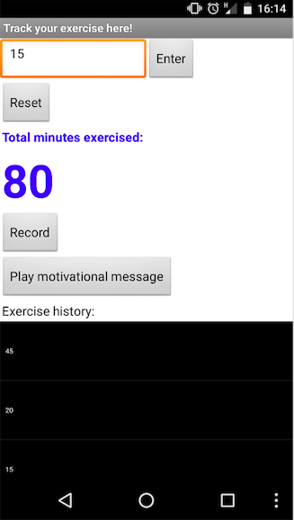

## Introduction

These cards are going to show you how to use App Inventor to make an app that tracks how much exercise you've done.

### What you will make

 * You'll end up with something that looks like this: 
 

### What you will learn

+ How to take text input from the user and display it
+ How to store information in a list
+ Using a loop to read the elements of a list
+ Saving information to a file on the phone
+ Loading and displaying information from a file
+ Making your own procedures
+ How to use the phone's sound recorder and play back a sound you've recorded
