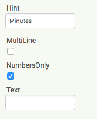
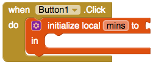

## Recording exercise

+ Create a new project and give it a name, for example `GetFit`.

+ Click on Screen1 under Components and change the Title property to `Track your exercise here!`.

+ Find the TextBox component in the Palette (under **User Interface**) and add it to your app, along with a Button.

+ Change the **Text** property of the button to `Enter`.

+ To arrange the components side by side, drag a **HorizontalArrangement** onto the screen (you'll find it in **Layout**) and drag the TextBox and Button into it.

+ Find the **Hint** property for the TextBox and type `Minutes`. This will appear faintly in the textbox if the user hasn't typed anything in yet, so they know what to type.

+ Check the box that says 'NumbersOnly' so that only a number can be entered in the TextBox.

Great! The user can type in the number of minutes they exercised for. Now you want to save that information when they press the button.

+ Switch to the Blocks and take out a `when Button.Click` block.

+ The first thing you'll need is to create a **local** variable to store the TextBox value in. Grab the `initialise local name to` block from Variables, and slot it into the `when Button Click` block.

+ Then click where it says `name` and instead type `mins` to name your local variable.

+ Take out a `Textbox.Text` block and attach it onto the `initialise local mins` block to store what's been typed into the TextBox.

Now that you've retrieved this information, you're going to create a **list** to put it in. After all, you want to be able to record lots of exercise sessions!

+ At the top of your code, add an `initialize global name to` block, and name it `minutesList`. Then find the `create empty list` block from Lists and use it to initialise your list.

+ From Lists, take the block `add items to list` and put it into your local variable block. 

You need to attach two things to this block: the list you want to add something to, and the 'something' you want to add, meaning the **item**.

+ Hover over the name of your global list variable and grab the `get global minutesList` block that appears. Connect this to the `list` attachment of the `add items to list` block.

+ Then do the same with the local variable, `mins`, to attach a `get mins` block to the **item** part of `add items to list`.

On the next card, you'll add all the list items together to work out the total amount of exercise you've done!
