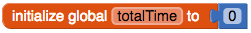
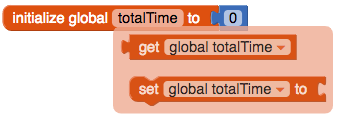

## Calculate the total

+ Create another global variable called `totalTime`.

+ Attach the `0` block from Math to initialise the variable to `0`.

Now every time you save a new time, you will add it onto the total.

+ Hover over the `totalTime` variable and grab a `set global totalTime to` block. Attach it underneath the `add items to list`.

+ From Math, take out the `+` block and attach it to `set global totalTime to`.

+ Into the left side of the `+`, plug in a `get global totalTime`, and into the right side, plug in a `get mins`. 

--- collapse ---
---
title: I can't find the blocks!
---

You find the `get` and `set` blocks for a variable by hovering the mouse over the name of the variable in the orange `initialise` block.

You can also find use the `get` and `set` blocks located in Variables, and click the little arrow to choose your variable.

--- /collapse ---

All that's left is to display the total so the user can see it!

+ Go back to the Designer and add two more labels to your app. Set the `Text` property of the first one to `Total minutes exercised:`

+ Change the Text property of the second label so that it's blank, and make a note of the name of this label (for example, Label2) so that you can set it to the total in your code!

+ If you want to, change the size and colour of the labels. I've made mine blue, and I changed the FontSize of the second label to 50!

+ Switch back to Blocks and add a `set Label.Text to` block to your code, together with a `get global totalTime` (choose the label you noted above!).

