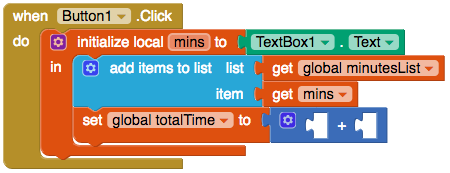

## Calculate the total

+ Create another global variable called `totalTime`.

+ Attach the `0` block from Math to initialise the variable to `0`.

Every time you save a new time, you are going to add it to the value of `totalTime`.

+ Hover over the `totalTime` variable and grab a `set global totalTime to` block. Attach it below the `add items to list` block.

+ From Math, take the `+` block and attach it to `set global totalTime to`.

+ On the left side of the `+`, plug in a `get global totalTime` block. On the right side, plug in `get mins`. 

--- collapse ---
---
title: I can't find the blocks!
---

You can find the `get` and `set` blocks for a variable by hovering the mouse over the name of the variable in the orange `initialise` block.

You can also use the `get` and `set` blocks located in Variables, and then click the little arrow in each block to choose your variable.

--- /collapse ---

Now, display the total so the user can see it!

+ Go back to the Designer view and add two more labels to your app. Set the Text property of the first one to `Total minutes exercised:`

+ Change the Text property of the second label so that it's blank, and make a note of this label's name (for example, Label2) so that you can set it to the total in your code!

+ If you want to, change the size and colour of the labels. I've made mine blue and checked **FontBold** to make them bold, and I changed the **FontSize** of the second label to `50`!

+ Switch back to Blocks and add a `set Label.Text to` block to your code, together with a `get global totalTime` block (choose the label name you made a note of above!).

Here's what your code should look like:

