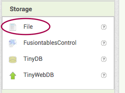
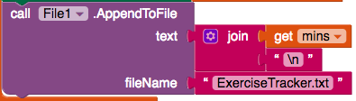
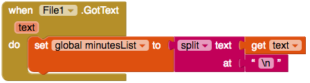

## Saving the information

Right now, your app only saves information so long as the app is still running. It would be much more useful for it to remember your exercise times even after you close the app and restart it, right? To do this you will store the information in a **file** on the phone or tablet, and read from the file every time the app starts.

+ In the Designer view, add a File component to your app. You'll find it in **Storage**. This is an invisible component, so you won't see it on the screen.

+ Now go to Blocks and click on File1 to get the block `call File1.AppendToFile`. Add this to your code after the `set Label.Text to`.

This block takes two **parameters**. The first, `text`, is the text that you want to store to a file. The second, `fileName` is the name of the file you want to use. The code will take the text you give it and add it onto the end of the text in the file. What's really handy is that if the file doesn't exist yet, the block will create it for you first.

--- collapse ---
---
title: What are parameters?
---

A parameter is a piece of information that you give a block. Usually, the block will do something with that information.

--- /collapse ---

+ For the `fileName` parameter, attach a `""` block from Text, and type in `ExerciseTracker.txt`.

+ For the `text` parameter, attach a `join` block, a `get mins` block, and another blank `""` Text block. Type `\n` into the blank text block, like this:

--- collapse ---
---
title: What did I just type?!
---

The symbol `\n` is a special combination of characters used when you want to go onto a new line.

Your code is taking the number of minutes that the user typed in, and adding a new line at the end before saving it to the file.

That means that each time the user enters a number of minutes, it will be saved on a separate line in the file.

--- /collapse ---

Now you've saved data to the file, you need to read that data when the app loads!

+ Take out a `when Screen1.initialise` and add in a `call File1.readFrom`, attaching a Text block with the file name `ExerciseTracker.txt` typed in as before.

This call is **asynchronous**, which means it will go away and read the file and then tell you when it's done.

+ From the File component, take out a `when File1.GotText do` block.

The `text` variable contains all the text from the file. You will use this to fill the **list** variable you created to collect the minutes. But first, you need to split it up to separate each line.

+ Add the following blocks inside the `GotText`:

--- collapse ---
---
title: How does splitting work
---

The `split` block takes one piece of text and splits it into several separate pieces.

Imagine you have one big long piece of text, and it's made up of a bunch of pieces of text, all joined together with dots in between. Using the `split` block would allow you to break the text up into the separate pieces of text and remove the dots.

What you put into the `at` decides how it splits the text up.

It searches the text for the value in the `at` block and each time it finds it, it "chops off" another piece of the text. The text that matches the `at` is also removed in the process.

What you are left with is a bunch of bits of text, which you get back in the form of a list.

--- /collapse ---

Now you will count up all the minutes you just loaded and display the total.

+ Under the `set global minutesList`, add code to set the global variable `totalTime` to `0`:

+ In the Control blocks, find the block `for each item in list`, and attach a `get global minutesList` to it.

+ Inside this, add a `set global totalTime to`, and a `+` block with `get global TotalTime` on the left, as you did before to add something to the total. The only difference this time is that the variable you put on the right of the `+` will be the current `item` of the list.

+ Finally, add `set Label.Text to` and `get global totalTime` as before.

+ Here's what your `GotText` block should look like now. Test out your app to make sure it all works!

