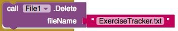
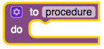
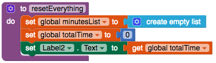

## Reset

If you're anything like me, you might want a way of deleting all the previously entered data and starting the tracking again at zero. Let's add a button to let you do that!

+ In the Designer view, add a Button. Change its label to `Reset`.

+ Go to Blocks and add a `when Button Click` block for the new button.

+ Into this block, add `call File1.Delete` with a Text block giving the file name `ExerciseTracker.txt`.

Now you will create a brand-new block of your own!

+ Click on **Procedures** in the Built-in blocks and drag out a `to procedure do` block.

+ Click the `procedure` label and change it to `resetEverything`.

--- collapse ---
---
title: What is a procedure?
---

A procedure is a bunch of code that you can **reuse** easily. 

Instead of duplicating the same blocks in several places, you put all of them into one block called a procedure. Then you can use just that one block whenever you want to run these blocks!

You can give a procedure any name you want.

--- /collapse ---

+ Inside the `resetEverything` block, add blocks to set the global `minutesList` to a new empty list, set the global `totalTime` to `0`, and display the new total:

+ Finally, in the `when Button Click` block of the button you've just made, add the block `call resetEverything` from Procedures.

Now you should be able to clear all the recorded exercise by clicking the new button!

