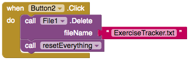

## Reset

If you're anything like me, you might want a way of deleting all the previously entered data and starting the tracking again at zero. Let's add a button to let you do that!

+ In the Designer, add a Button. Change its text to `Reset`.

+ Go to Blocks and add a `when Button Click`.

+ Into that, add a `call File1.Delete` with a Text block for the fileName, `ExerciseTracker.txt`:

Now you will create a brand new block of your own!

--- collapse ---
---
title: What is a procedure
---

A procedure is a bunch of code that you can **reuse** easily. 

Instead of duplicating the same blocks in several places, you put all of them into their own new block called a procedure and then use just that one block whenever you want to run them!

--- /collapse ---

+ Click on Procedures in the Built-in blocks and drag out a `to procedure do` block.

+ Click `procedure` and change it to `resetEverything`.

+ Inside the block, add blocks to set the global `minutesList` to a new empty list, set the global `totalTime` to `0` and display the new total:

+ Now, in your Button click code, add the block `call resetEverything` from Procedures.

