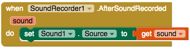

## Record a message!

Getting fit isn't easy. Sometimes it can be hard to motivate yourself to go and exercise. How about letting the user record a message that they can play whenever they need some extra motivation!

+ Go to the Designer and add two more Buttons to your app. Set the text of them to `Play motivational message` and `Record`, or something similar.

+ Then, from Media, add a **Sound** and a **SoundRecorder** component. Just like the File component, these won't be visible on the screen.

+ In Blocks, add a `when Button.TouchDown` and a `when Button.TouchUp` block for the "Record" button. Instead of detecting the usual click of the button, you're going to start recording when the user presses and holds the button and stop recording when they stop pressing.

+ Add a `call SoundRecorder.Start` to the `TouchDown` and a `call SoundRecorder.Stop` to the `TouchUp`:

Now you've recorded the sound, you need to set up the Sound component to play it!

+ Drag out the `when SoundRecorder.AfterSoundRecorded` block.

+ In the Sound component, find the `set Sound1.Source to` and put that inside the block you just took out.

The `AfterSoundRecorded` block has a variable called `sound`. This is the file path to the sound that was just recorded.

+ Hover over the `sound` variable and take the `get sound` block to attach on as the source for the Sound component:

+ Finally, take out a `Button.Click` for the "Play" button and in it put a `call Sound1.Play` from the Sound component.

And you're done!

+ Try out your new app and have some fun recording and playing back your own motivational messages!

--- challenge ---
## Challenge: Save the sound

- See if you can use a File component to make the app remember the location of the sound file to play.

--- /challenge ---