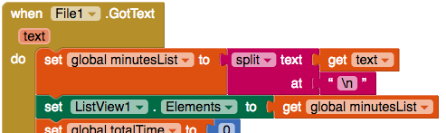

## Display the exercise history

At the moment your app only displays the total minutes exercised, but since you've got the list of all the individual sessions, why not show that as well?

+ Go to the Designer and add a ListView from **User Interface**.

+ If you want, you can also add a label above it that says something like `Exercise history:`.

As you might have guessed, a ListView displays a **list** of things. Similar to how you set the **Text** property of a Label to some text, you set the **Elements** property of a ListView to a list. You will do this in two places in your code.

First, you need to update the ListView whenever the user enters a new exercise time. 

+ In the `Button.Click` for the "Enter" button, add a `set ListView.Elements to` and a `get global minutesList` after the `AppendToFile`.

Secondly, you need to update it whenever you load the list from the file.

+ Find your `File1.GotFile` code, and add `set ListView.Elements to` and a `get global minutesList` (the same code as above) right after the `set global minutesList to`:

And your app is complete!

--- challenge ---

## Challenge: Track the type of exercise

+ How about adding another textbox that lets the user also record what exercise they did? You'll have to think about what extra code you'll need such as lists, loops, and how to store the new information in a file.

+ You can either use the same file (with some extra `join` and `split` code) or a separate one.

--- /challenge ---

You can see an example of this app on App Inventor at [dojo.soy/intermedapp](http://dojo.soy/intermedapp){:target="_blank"} 