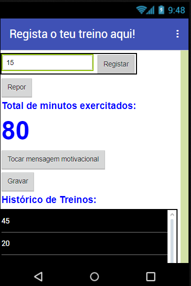

## Introdução

Estes cartões vão mostrar-te como usar o App Inventor para criar uma aplicação que registe a quantidade de exercícios fizeste.

### O que vais fazer

 * O resultado será algo parecido com isto:

--- collapse ---
---
title: O que vais aprender
---

+ Receber texto introduzido pelo utilizador e exibi-lo
+ Armazenar informações numa lista
+ Usar um ciclo para ler os elementos de uma lista
+ Guardar informações num ficheiro do telemóvel
+ Carregar e exibir informações de um ficheiro
+ Criar os teus próprios procedimentos
+ Usar o gravador de som do telemóvel e reproduzir o som que gravaste

--- /collapse ---

--- collapse ---
---
title: O que vais precisar
---

### Equipamento

+ Um computador capaz de aceder ao App Inventor
+ Conexão à Internet

**Opcional:**

+ Um telemóvel Android ou tablet

--- /collapse ---