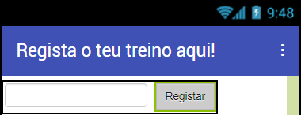
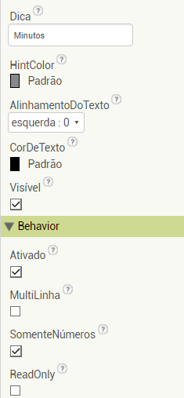
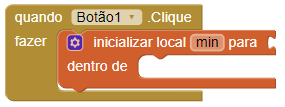
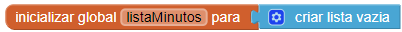
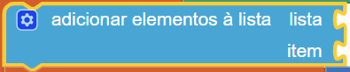
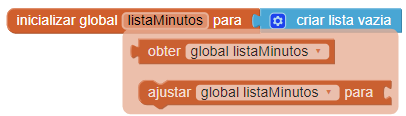
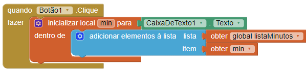

## Registar os exercícios

+ Cria um novo projeto e atribui-lhe um nome, por exemplo `FicarEmForma`.

+ Clica no Ecrã1 na secção Componentes e altera a propriedade Título para `Regista o teu treino aqui!`.

+ Encontra o componente CaixaDeTexto na secção Paleta (na **Interface de Usuário**) e adiciona-o à tua aplicação, juntamente com um Botão.

+ Altera a propriedade **Texto** do Botão para `Registar`.

+ Para arranjar os componentes lado a lado, arrasta uma **OrganizaçãoHorizontal** para o ecrã (vais encontrá-la na **Organização**) e arrasta a CaixaDeTexto e o Botão para lá.

+ Encontra a propriedade **Dica** da CaixaDeTexto e escreve `Minutos`. Isto vai aparecer levemente na CaixaDeTexto se o utilizador ainda não tiver escrito nada, para que saiba o que escrever.

+ Marca a opção que diz 'SomenteNúmeros' para que apenas seja possível introduzir números na CaixaDeTexto.

Ótimo! O utilizador pode escrever o número de minutos durante os quais se exercitou. Agora queres guardar essa informação quando pressionarem o botão.

+ Muda para Blocos e junta o bloco `quando Botão.Clique`.

+ A primeira coisa que vais precisar é criar uma variável **local** para armazenar o valor da CaixaDeTexto. Agarra no bloco `inicializar local nome para` em Variáveis, e coloca-o dentro do bloco `quando Botão.Clique`.

+ De seguida, clica onde diz `nome` e troca para `min` para atribuir um nome à tua variável local.

+ Tira um bloco `CaixaDeTexto.Texto` e adiciona-o dentro do bloco `inicializar local min` para armazenar o que for escrito na CaixaDeTexto.

Agora que retiveste esta informação, vais criar uma **lista** para armazená-la. No final das contas, vais querer registar muitas sessões de exercícios!

+ Na parte superior do teu código, adiciona um bloco `inicializar global nome para`, e chama-o de `listaMinutos`. Depois encontra o bloco `criar lista vazia` em Listas e usa-o para inicializar a tua lista.

+ Em Listas, retira o bloco `adicionar elementos à lista` e coloca-o dentro do bloco da tua variável local.

Precisas de anexar duas coisas a este bloco: a lista à qual queres adicionar algo e o 'algo' que queres adicionar, ou seja, o **elemento**.

+ Passa o cursor sobre o nome da tua variável global da lista e agarra o bloco que aparece `obter global listaMinutos`. Anexa-o à `lista` do bloco `adicionar elementos à lista`.

+ A seguir, faz o mesmo à variável local, `min`, e adiciona o bloco `obter min` na parte do **item** do `adicionar elementos à lista`.

No próximo cartão, irás adicionar todos os elementos da lista para calcular a quantidade total de exercícios que praticaste!
