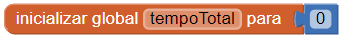
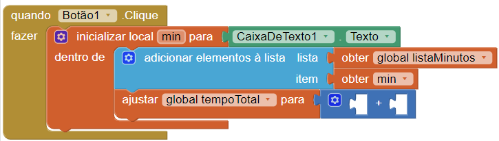
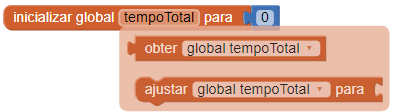
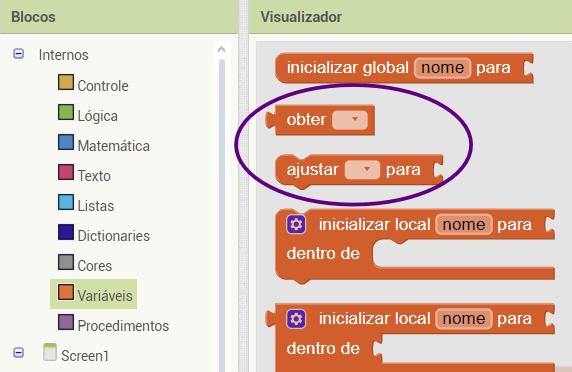
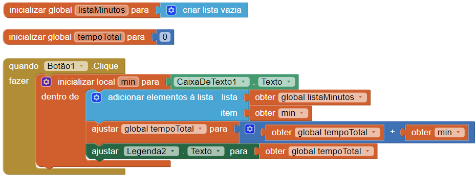

## Calcular o total

+ Cria outra variável global chamada `tempoTotal`.

+ Anexa o bloco `0` da Matemática para iniciar a variável a `0`.

Cada vez que adicionar um novo tempo, vai adicionar o valor ao `tempoTotal`.

+ Passa o cursor pela variável `tempoTotal` e tira o bloco `ajustar global tempoTotal para`. Coloca-o por baixo do bloco `adicionar elementos à lista`.

+ Da Matemática, tira o bloco `+` e coloca-o no `ajustar global tempoTotal para`.

+ No lado esquerdo do `+`, coloca o bloco `obter global tempoTotal`. No lado direito, coloca o `obter min`.

--- collapse ---
---
title: Não consigo encontrar os blocos!
---

Podes encontrar o bloco `obter` e o `ajustar` de uma variável ao passar com o cursor por cima do nome dessa variável no bloco laranja `inicializar`.

Também podes usar os blocos `obter` e o `ajustar` localizados nas Variáveis e, em seguida, clica na seta pequena em cada bloco para escolher a variável.

--- /collapse ---

Agora, mostra o total para que o utilizador consiga vê-lo!

+ Volta para o Editor de Ecrãs e adiciona mais duas Legendas à tua aplicação. Define a propriedade Texto do primeiro para `Total de minutos exercitados:`

+ Altera a propriedade Texto da segunda Legenda para que fique em branco, e anota o nome dessa Legenda (por exemplo, Legenda2) para que consigas defini-la como Total no teu código!

+ Se quiseres, altera o tamanho e a cor das Legendas. Deixei as minhas a azul e marquei a **FonteNegrito** para ficarem a negrito, e mudei o **TamanhoDaFonte** da segunda Legenda para `50`!

+ Volta para Blocos e adiciona o bloco ao teu código `ajustar Legenda.Texto para` juntamente com o bloco `obter global tempoTotal` (escolhe o nome da Legenda que anotaste acima!).

Este é o aspeto que o teu código deve ter:

