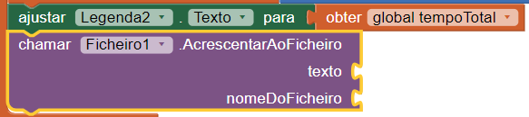
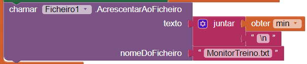
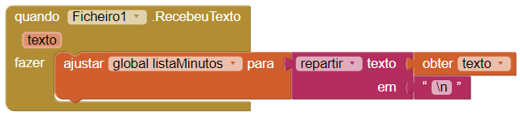
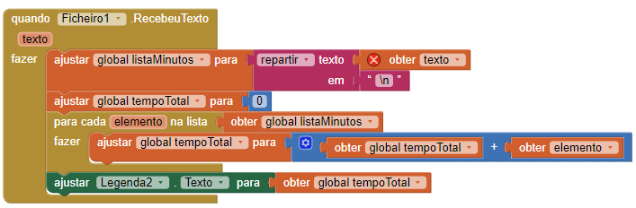

## Armazenar a informação

Por agora, a tua aplicação apenas guarda a informação enquanto estiver em execução. Seria muito mais útil se guardasse o tempo dos exercícios, mesmo depois de a fechar ou reiniciar, certo? Para tal, precisas de armazenar a informação num ficheiro no teu telemóvel ou tablet, e lidas a partir desse ficheiro sempre que a aplicação for iniciada.

+ No Editor de Ecrãs, adiciona o componente **Ficheiro** à tua aplicação. Podes encontrá-lo em **Armazenamento**. É um componente invisível, por isso não o verás no ecrã.

+ Volta para Blocos e clica no Ficheiro1 para obteres o bloco `chamar Ficheiro1.AcrescentarAoFicheiro`. Adiciona-o ao teu código depois do bloco `ajustar Legenda.Texto para`.

--- collapse ---
---
title: O que faz o novo bloco?
---

Este bloco contém dois **parâmetros**. Um parâmetro é um pedaço de informação que se dá a um bloco. Normalmente, o bloco fará algo com essa informação.

O primeiro parâmetro, `texto`, é o texto que pretendes armazenar num ficheiro. O segundo, `nomeDoFicheiro` é o nome do ficheiro que pretendes usar para armazenar.

O código recebe o texto que lhe dás e adiciona-o ao fim do texto no ficheiro. O que é realmente útil é que, se o ficheiro ainda não existir, o bloco vai criá-lo primeiro por ti.

--- /collapse ---

+ Para o parâmetro `nomeDoFicheiro`, adiciona o bloco `""` do Texto, e escreve `MonitorTreino.txt`.

+ Para o parâmetro `texto`, adiciona o bloco `juntar`, o bloco `obter min` e outro bloco `""` vazio do Texto. Escreve `\n` no bloco de texto vazio (certifica-te que usas a barra invertida `\` e **não** a barra <0>/</0>).

--- collapse ---
---
title: O que acabei de escrever?
---

O símbolo `\n` é uma combinação especial de caracteres que é usada quando pretendes passar para uma nova linha num texto.

O teu código recebe o número de minutos que o utilizador escreveu e adiciona uma nova linha no final antes de guardar o ficheiro.

Isto significa que, cada vez que o utilizador inserir um número de minutos, esses serão guardados numa linha separada no texto do ficheiro que nomeaste de `MonitorTreino.txt`.

--- /collapse ---

Agora que guardaste informação no ficheiro, precisas de ler a informação sempre que a aplicação carregar!

+ Procura pelo bloco `quando Ecra1.inicializar` e adiciona-lhe o `chamar Ficheiro1.LerDe`, anexa um bloco de Texto com o nome do ficheiro `MonitorTreino.txt` que escreveste antes.

Isto é chamado **assíncrona**, que significa que lerá o ficheiro e depois informará quando tiver terminado a tarefa.

+ Do Ficheiro1, retira o bloco `quando Ficheiro1.RcebeuTexto`.

A variável `texto` contém todo o texto do ficheiro. Irás usar isto para preencher a variável **lista** que criaste para receber os minutos. Mas primeiro, é preciso dividi-lo para separar cada linha.

+ Adiciona os seguintes blocos dentro do `RecebeuTexto`:

--- collapse ---
---
title: Como funciona a repartição?
---

O bloco `repartir` pega num pedaço do texto e reparte-o em diversas partes.

Imagina que tens um texto grande e longo, que é composto por várias partes unidas por pontos entres elas. Ao usar o bloco `repartir` consegues repartir esse texto em partes separadas de texto e remover os pontos.

O que escreveres no `em` decide como o texto será repartido.

Procura no texto pelo valor do bloco `em`, e cada vez que encontrar, corta outro pedaço do texto. O texto que corresponder ao valor de `em` é removido no processo.

O que recebes é uma lista que contêm várias partes separadas do texto!

--- /collapse ---

Agora vais somar todos os minutos que acabaste de carregar do ficheiro e exibir o total.

+ Debaixo do `ajustar global listaMinutos`, adiciona código para ajustar a variável global `tempoTotal` para `0`:

+ Nos blocos de Controle, encontra o bloco `para cada elemento na lista`, e adiciona-lhe o `obter global listaMinutos`.

+ Dentro do mesmo bloco, adiciona `ajustar global tempoTotal`, e depois um bloco `+` com `obter global tempoTotal` na esquerda. Lembra-te, já fizeste isto antes para adicionar algo ao total. A única diferença é que, desta vez a variável é colocada à direita do `+`: o atual `elemento` da lista.

+ Por fim, adiciona o bloco `ajustar Legenda2.Texto para` e o `obter global tempoTotal`, como já fizeste antes.

+ Este é o aspeto que o teu bloco `RecebeuTexto` deve ter agora. Testa a tua aplicação para teres a certeza que tudo funciona!

