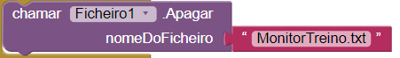
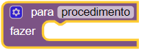
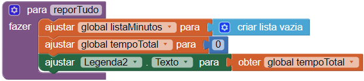
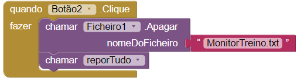

## Reiniciar

Se fores como eu, talvez queiras uma forma de apagar todos os dados inseridos anteriormente e começar a monitorizar do zero novamente. Vamos adicionar um botão que te permita fazê-lo!

+ No Editor de Ecrãs, adiciona um botão. Altera o seu nome para `Repor`.

+ Vai para Blocos e adiciona o bloco `quando Botao.clique` para o novo botão.

+ Neste bloco, adiciona `chamar Ficheiro1.Apagar` com um bloco de Texto contendo o nome do ficheiro `MonitorTreino.txt`.

Agora vais criar um bloco novinho em folha!

+ Clica em **Procedimentos** nos blocos Internos e arrasta o bloco `para procedimento fazer`.

+ Clica no nome do `procedimento` e altera-o para `reporTudo`.

--- collapse ---
---
title: O que é um procedimento?
---

Um procedimento é um conjunto de código que podes **reutilizar** facilmente.

Em vez de duplicar os mesmos blocos em diversos sítios, juntasse tudo num só bloco e é chamado de procedimento. Podes então, usar apenas um bloco sempre que quiseres executar aqueles blocos!

Podes dar a um procedimento o nome que quiseres.

--- /collapse ---

+ Dentro do bloco `reporTudo`, adiciona os blocos para definir a global `listaMinutos` para uma nova lista vazia, define a global `tempoTotal` para `0`, e exibir o novo total:

+ Por fim, no bloco do botão que criaste `quando Botão.Clique`, adiciona o bloco `chamar reporTudo` de Procedimentos.

Agora deves conseguir limpar todos os registos de exercícios ao clicar no novo botão!

