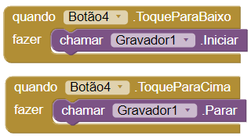
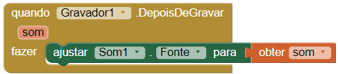
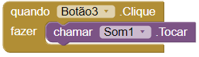

## Grava uma mensagem!

Ficar em forma não é fácil: por vezes pode ser difícil encontrares motivação para fazeres exercícios. Que tal deixares o utilizador gravar uma mensagem que ele possa reproduzir quando precisar de motivação extra?

+ Vai para o Editor de Ecrãs e adiciona mais dois botões. Define o texto de cada um para `Tocar mensagem motivacional` e `Gravar`, ou algo semelhante.

+ Depois, de **Multimédia**, adiciona um componente **Som** e um **Gravador**. Tal como o componente Ficheiro, estes não vão ser visíveis no ecrã.

+ Em Blocos, adiciona os blocos `quando Botão.ToqueParaBaixo` e `quando Botão.ToqueParaCima` para o botão `Gravar`. Desta vez, não irás detetar o clique habitual do botão. Em vez disso, irás começar a gravar quando o utilizador pressionar e segurar o botão, e parar a gravação quando ele parar de pressionar.

+ Adiciona o `chamar Gravador1.Iniciar` ao bloco `ToqueParaBaixo`, e o `chamar Gravador1.Parar` ao bloco `ToqueParaCima`, desta forma:

Agora que podes gravar sons, precisas de configurar o componente Som para reproduzi-los!

+ Arrasta para fora o bloco `quando Gravador1.DepoisDeGravar`.

+ No componente Som, encontra o bloco `ajustar Som1.Fonte para` e coloca-o dentro do bloco que acabaste de arrastar.

O bloco `DepoisDeGravar` tem uma variável chamada `som`. Aqui é quando informas ao bloco onde pode encontrar o ficheiro de som que gravaste.

+ Passa o cursor sobre a variável `som` e tira o bloco `obter som` para anexá-lo como fonte do componente Som:

+ Por fim, tira o bloco `Botão.Clique` para o botão `Tocar`. Dentro dele, põe o `chamar Som1.Tocar` do componente Som.

+ Testa a aplicação e diverte-te a gravar e reproduzir as tuas mensagens motivacionais!

--- challenge ---

## Desafio: guarda o som

- Vê, se podes usar o componente Ficheiro para fazer a aplicação lembrar-se da localização do ficheiro de som para reproduzi-lo.

--- hints ---

--- hint ---

+ Usa outro componente Ficheiro e um ficheiro separado com outro nome, por exemplo, `MensagemMotivacional.txt`.

+ Usa o bloco `GuardarOFicheiro` em vez do `AcrescentarAoFicheiro`, para que consigas sempre substituir o ficheiro anterior com a nova gravação.

--- /hint ---

--- /hints ---

--- /challenge ---
