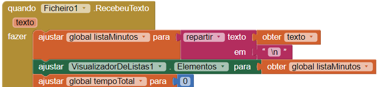

## Exibir o histórico de treino

Até ao momento a tua aplicação apenas exibe o total de minutos exercitados, mas já que tens a lista de todos os treinos, porque não mostrá-la também?

+ Vai para o Editor de Ecrãs e adiciona **VisualizadorDeListas** da **Interface de Usuário**.

+ Se quiseres, podes adicionar uma legenda por cima da lista que diga algo deste género `Histórico de Treinos:`.

Como deves ter adivinhado, o VisualizadorDeListas exibe uma lista de coisas. Define a propriedade **Elementos** do VisualizadorDeListas para uma lista, como definiste a propriedade texto da Legenda para um texto. Farás isso em dois sítios no teu código.

Primeiro, precisas de atualizar o VisualizadorDeListas sempre que o utilizador inserir um novo tempo de treino.

+ No `Botão.Clique` para o botão `Registar`, adiciona o bloco `ajustar VisualizadorDeListas.Elementos para` e o bloco `obter global listaMinutos` abaixo do `AcrescentarAoFicheiro`.

Em segundo, precisas de atualizar o VisualizadorDeListas sempre que carregar o ficheiro da lista.

+ Encontra o código `Ficheiro1.RecebeuTexto` e adiciona `ajustar VisualizadorDeListas.Elementos para` e `obter global listaMinutos` (o mesmo código acima) logo debaixo do bloco `ajustar global listaMinutos para`.

E a tua aplicação está completa!

--- challenge ---

## Desafio: regista o tipo de exercício

+ Que tal adicionar outra CaixaDeTexto que permita que o utilizador registe que tipo de exercícios fez? Terás que pensar sobre que código extra vais precisar, como listas e ciclos, e como armazenar a nova informação num ficheiro.

+ Podes usar o mesmo ficheiro (com algum código extra `juntar` e `repartir`), ou um ficheiro separado.

--- /challenge ---

Podes ver um exemplo desta aplicação no App Inventor [dojo.soy/intermedapp](http://dojo.soy/intermedapp){:target="_blank"}.
